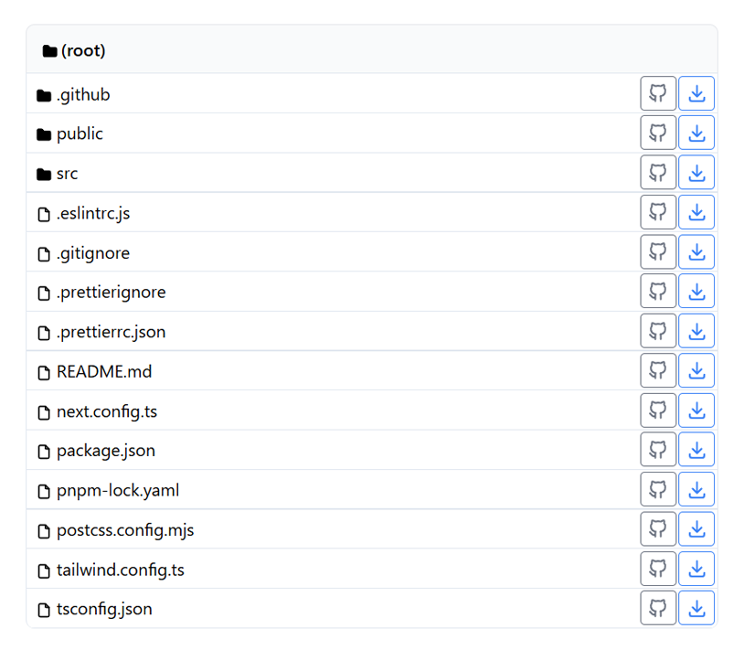
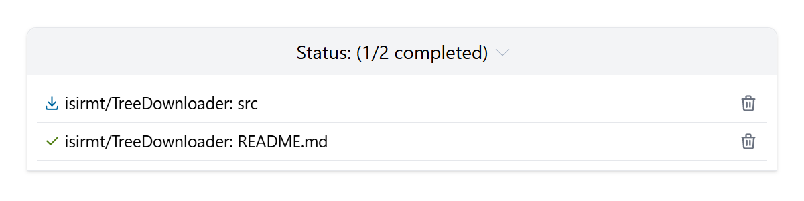

# SourceSnap

<p align="center">
  
</p>
<p align="center">
  Download Files/Folders from GitHub
</p>
<p align="center">
  
  
  
  
  
</p>

## How to use

Simply enter any repository or select from the candidates and download the specific path.

<p align="center">
  
</p>

The status can be found at the bottom of the page.

<p align="center">
  
</p>

## Development

To install the module, run the following in the root directory.

```bash
pnpm i
```

To run the development environment,

```bash
pnpm dev
```

To build the local environment,

```bash
pnpm build
```

To run lint,

```bash
pnpm check
# or
pnpm lint
pnpm lint:fix
pnpm fmt
```

## License

The source code is licensed MIT, see [LICENSE](/LICENSE).
